## **Documentation for Project 14**

### Configuring our Ansible Project For Jenkins Deployment using Blue Ocean Jenkins Plugin

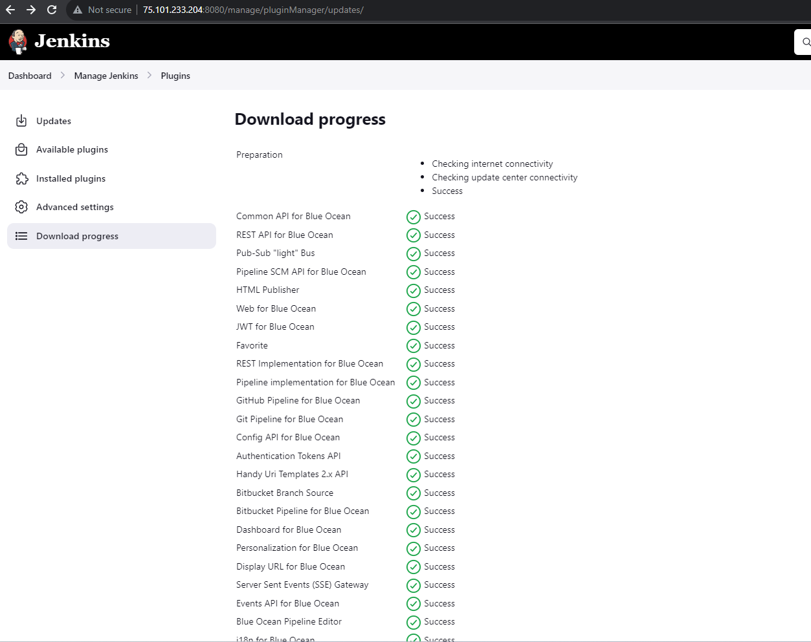

### Creating a new Pipeline with Blue Ocean

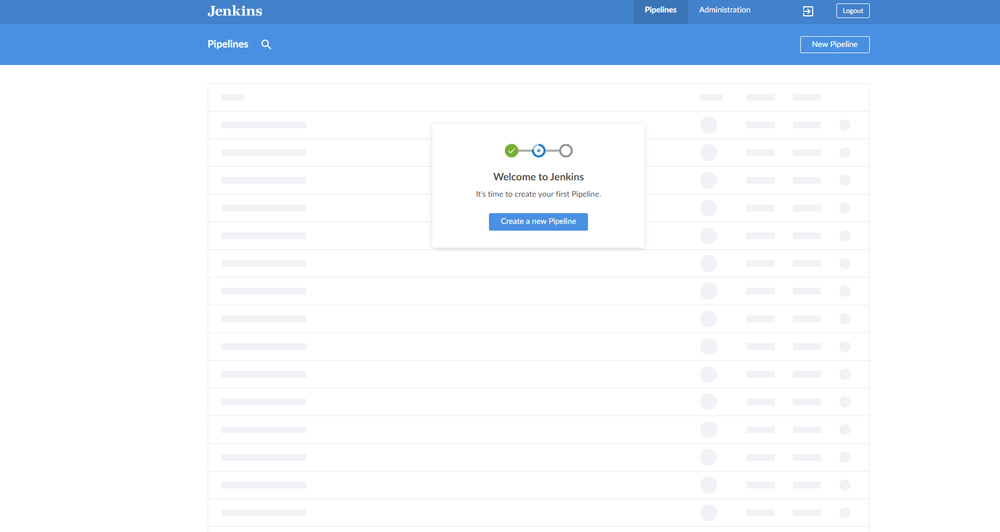

### Jenkins Successfully Connected with our Github Repo

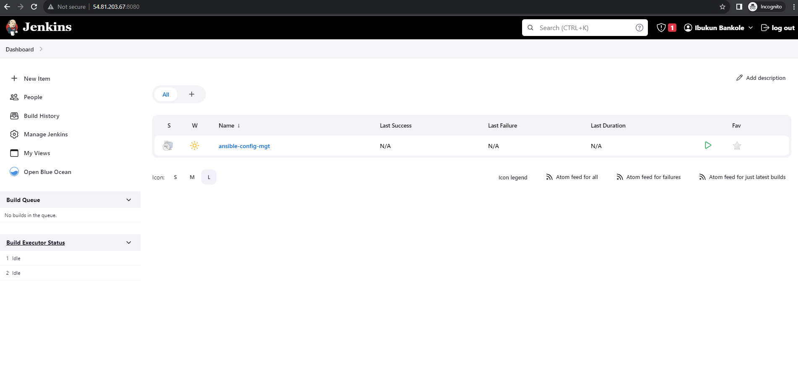

### Setting up a deploy Directory in our Ansible Project and creating a jenkins file in it which will be used by jenkins for building our project

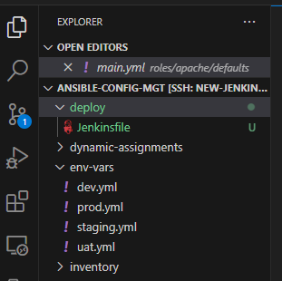

### Inserting our Shell script code snippet into our Jenkins file to Trigger our build process

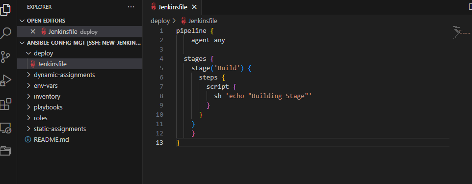

### Specifying the Location of our Jenkins file under our Project config on Jenkins

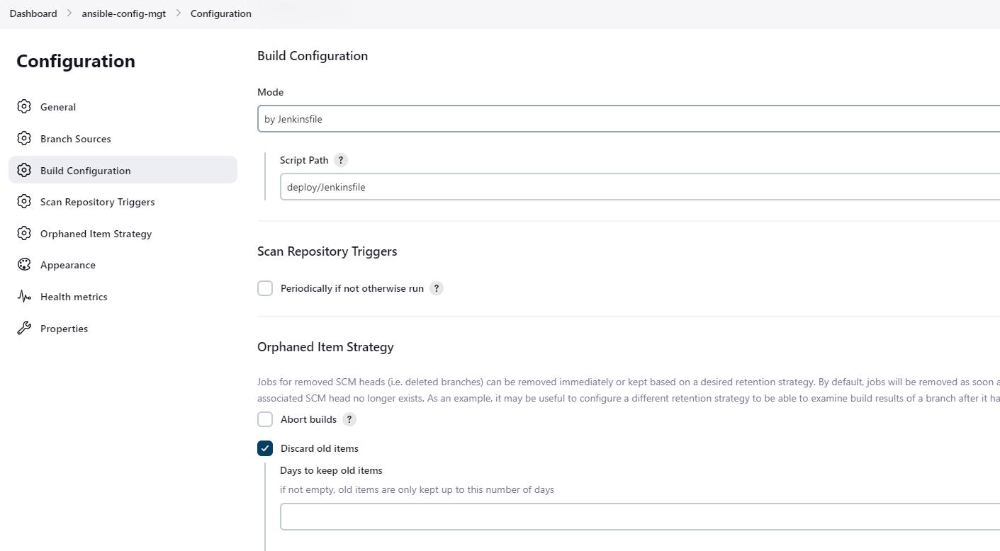

### Our Pipeline CI Environment build Console Output

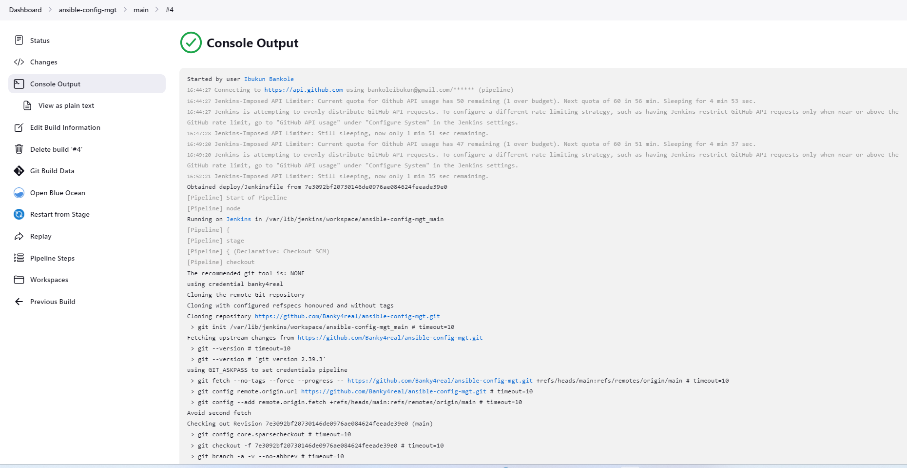

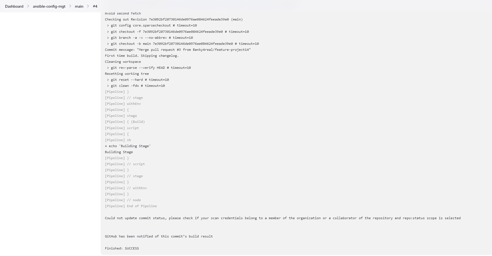

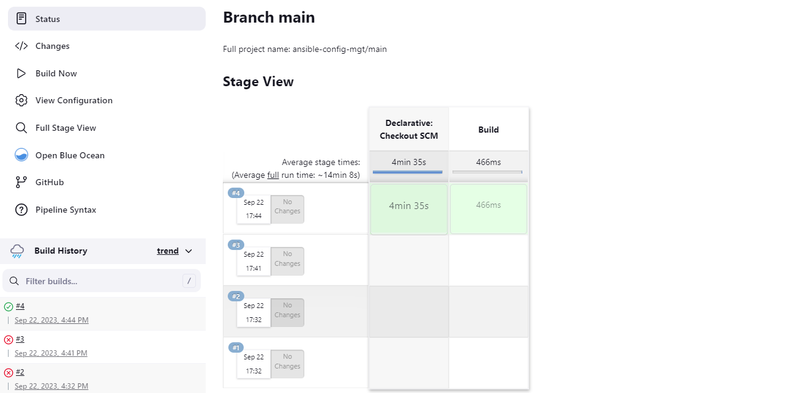

### Triggering Build for a Multibranch Pipeline

### Creating a new Git Branch under our Ansible Config Project

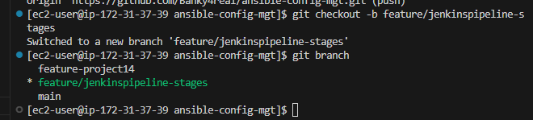

### New Stage Added to our pipeline build script

### Pushing our Changes to github

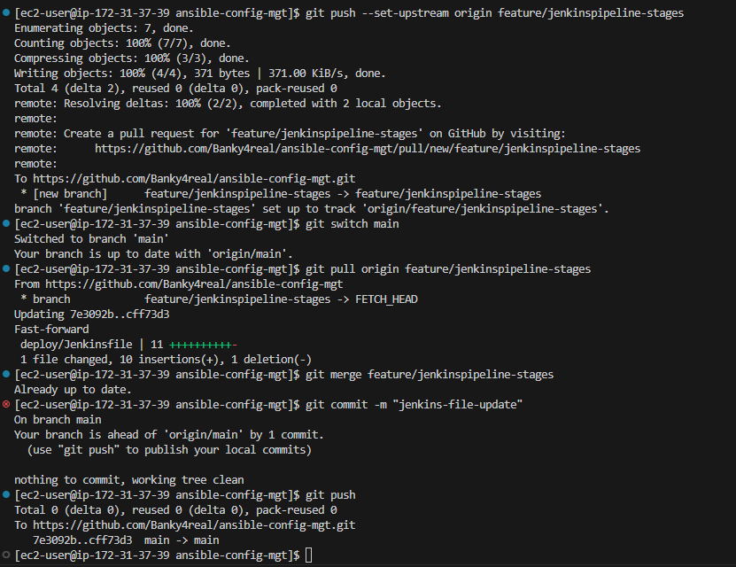

### Scanning our Repository on Jenkins and Launching a new build for the new stage(Test) in our Jenkins file script

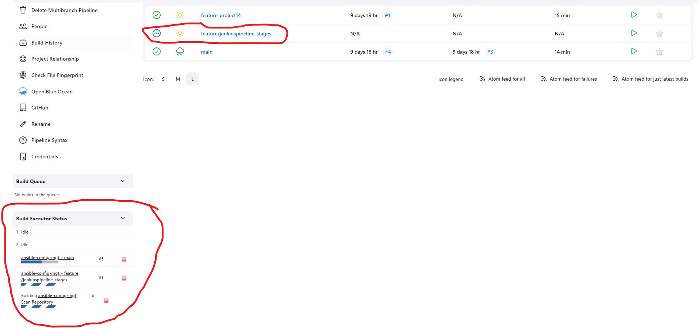

### New stage (Test) successful build

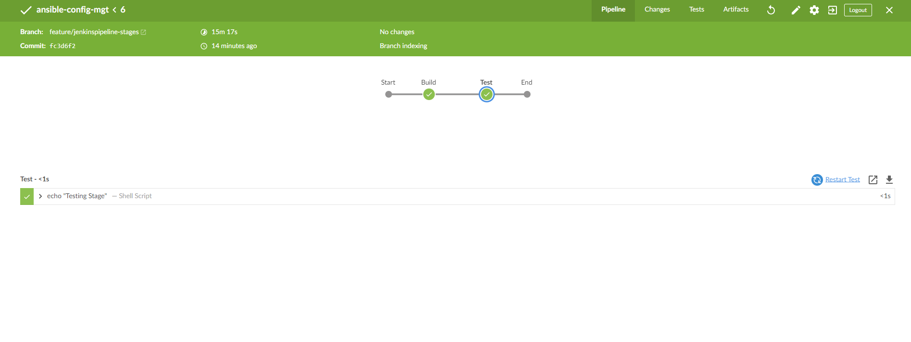

### Quick Task Execution

### New git branch Created

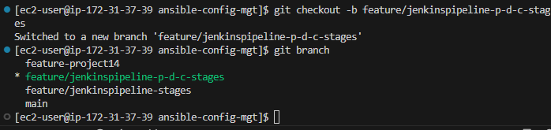

### New stages added to our Jenkins file pipeline script

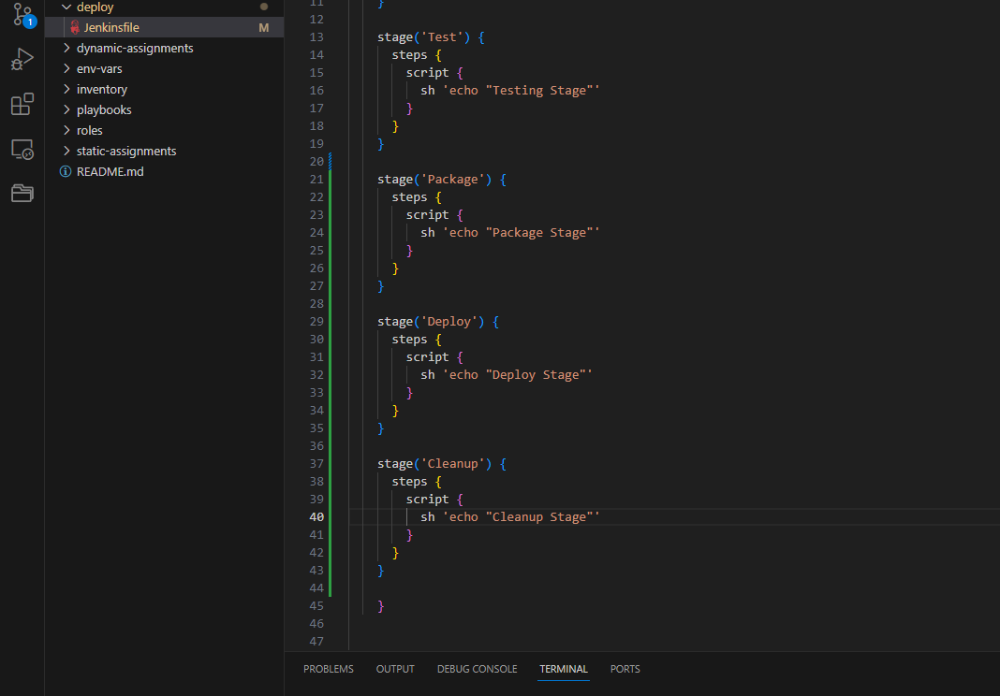

### Scanning our Repository on Jenkins to Launch a new build for our new stages (package, deploy and cleanup) in our Jenkins file script

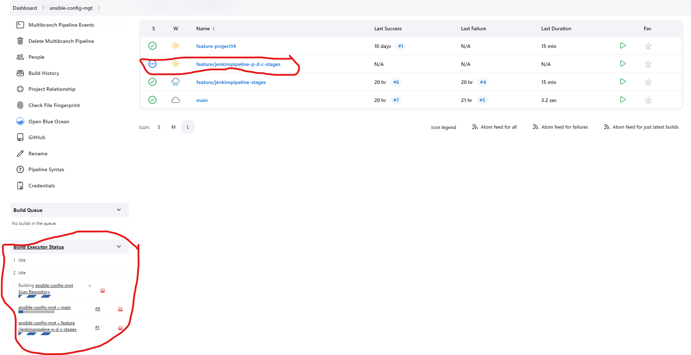

### Successful Pipeline build for our stages in blue Ocean

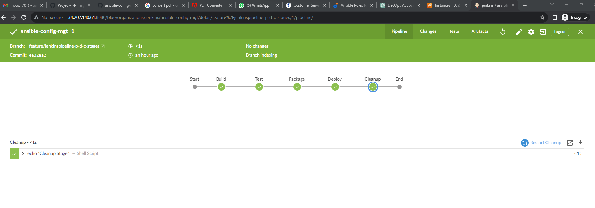