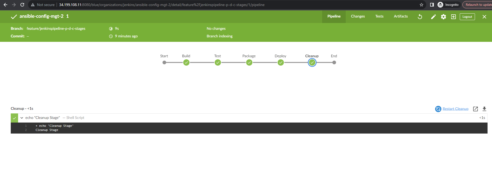

## **Documentation for Project 14**

### Configuring our Ansible Project For Jenkins Deployment using Blue Ocean Jenkins Plugin

### Jenkins Blue Ocean Plugin Installation

### Setting up a deploy Directory in our Ansible Project and creating a jenkins file in it which will be used by jenkins for building our project

### Inserting our Shell script code snippet into our Jenkins file to Trigger our build process

### Specifying the Location of our Jenkins file under our Project config on Jenkins

### First successful Build

### Our Pipeline CI Environment build Console Output

### Triggering Build for a Multibranch Pipeline

### Creating a new Git Branch under our Ansible Config Project

### Creating a new Git Branch under our Ansible Config Project

### New Stage Added to our pipeline build script

### Pushing our Changes to github

### Scanning our Repository on Jenkins and Launching a new build for the new stage(Test) in our Jenkins file script

### New stage (Test) successful build

### Quick Task Execution

### Pulling the latest change to main branch

### New git branch Created for new stages

### New stages updated in Jenkinsfile build script

### Changes pushed to github Branch

### Scanning our Repository on Jenkins to Launch a new build for our new stages (package, deploy and cleanup) in our Jenkins file script on a new Branch

### Successful Pipeline build for our stages in blue Ocean (Stage view in Blue Ocean)

### Successful Pipeline build for our stages in Jenkins (Stage view in Jenkins)

