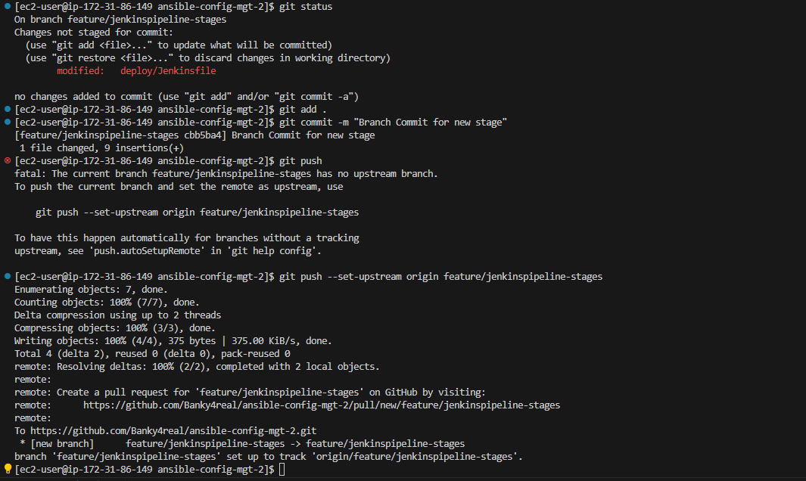

## **Documentation for Project 14**

### Configuring our Ansible Project For Jenkins Deployment using Blue Ocean Jenkins Plugin

### Jenkins Blue Ocean Plugin Installation

### Creating a new pipeline in blue Ocean

### Setting up a deploy Directory in our Ansible Project and creating a jenkins file in it which will be used by jenkins for building our project

### Inserting our Shell script code snippet into our Jenkins file to Trigger our build process

### Specifying the Location of our Jenkins file under our Project config on Jenkins

### First successful Build

### Our Pipeline CI Environment build Console Output

### Triggering Build for a Multibranch Pipeline

### Creating a new Git Branch under our Ansible Config Project

### Creating a new Git Branch under our Ansible Config Project

### New Stage Added to our pipeline build script

### Pushing our Changes to github

### Scanning our Repository on Jenkins and Launching a new build for the new stage(Test) in our Jenkins file script

### New stage (Test) successful build

### Quick Task Execution

### Pulling the latest change to main branch

### New git branch Created for new stages

### New stages updated in Jenkinsfile build script

### Changes pushed to github Branch

### Scanning our Repository on Jenkins to Launch a new build for our new stages (package, deploy and cleanup) in our Jenkins file script on a new Branch

### Successful Pipeline build for our stages in blue Ocean (Stage view in Blue Ocean)

### Successful Pipeline build for our stages in Jenkins (Stage view in Jenkins)

## Deploying with Ansible by Running Ansible Playbook From Jenkins

### Ansible Installation on Jenkins CI Server

### Ansible plugin installation on Jenkins UI

### Adding our Credentials on Jenkins so that it will be able to run our play book

### Specifying the path to our ansible interpreter on jenkins so it can build project

### Generating Pipeline script to run ansible playbook from Jenkins

### Defining a global ansible config for jenkins

### Running Playbook from Jenkins

### Parameterizing our Jenkins file to make our CI Environment Dynamic by removing the hardcoded value for our inventory and making the inventory variable dynamic

## Pipeline for Todo Application

### Deploying Todo Applications Onto Servers using Artifactory

#### Forking ToDo Application into our Github account or on our Jenkins Server

`git clone https://github.com/darey-devops/php-todo.git`

### Installing the necessary Dependencies to successfully deploy our Php Application and omposer tool.

`sudo yum module reset php -y`
`sudo yum install -y php php-common php-mbstring php-opcache php-intl php-xml php-gd php-curl php-mysqlnd php-fpm php-json`
`sudo dnf install https://dl.fedoraproject.org/pub/epel/epel-release-latest-8.noarch.rpm`
`sudo dnf module install php:remi-7.4`
`sudo dnf --enablerepo=remi install php-phpunit -phploc`
`sudo wget -O phpunit https://phar.phpunit.de/phpunit-7.phar`
`chmod +x phpunit`
`sudo yum install php-xdebug`
`sudo yum install zip`

### php Composer
`sudo curl -sS https://getcomposer.org/installer | php`
`sudo mv composer.phar /usr/bin/composer`

### Installing Plot Plugin and Artifactory Plugin on Jenkins

### Installing artifactory on an artifactory server using ansible playbook role

### Jfrog Live on port 8081

### Configuring Jfrog Artifactory in jenkins UI via installed Artifactory Plugin

### Integrating Artifactory repository with Jenkins

### Creating a dummy Jenkins file in Phptodo Repo

### Creating a Database and User on DB server using ansible playbook mysql role

### Creating a Multi-Branch Jenkins Pipeline Using Blue Ocean

### Prepare Dependency stage Script from our Jenkinsfile in our our phptodo app using 'mv .env.sample .env' shell to rename .env.sample to .env , composer install shell to install all the dependent libraries used by the application and php artisan shell to setup the required database objects

### Updating our Jenkins File to Include unit test stage, code quality analysis stage and archiving our application code to upload into artifactory and Publishing it to Artifactory

### Deploying our code artifacts to artifactory server

### Artifacts live on artifactory server

### Plot Menu

### Deploying our php-todo application to todo server in Dev Environment

### php-todo application successfully deployed on todo server in Dev Environment

#

### php-todo application live on todo server

### Installing Sonarqube using downloaded sonarqube role from ansible galaxy

### Installing ansible community role for postgresql installation

### Postgresql installation

